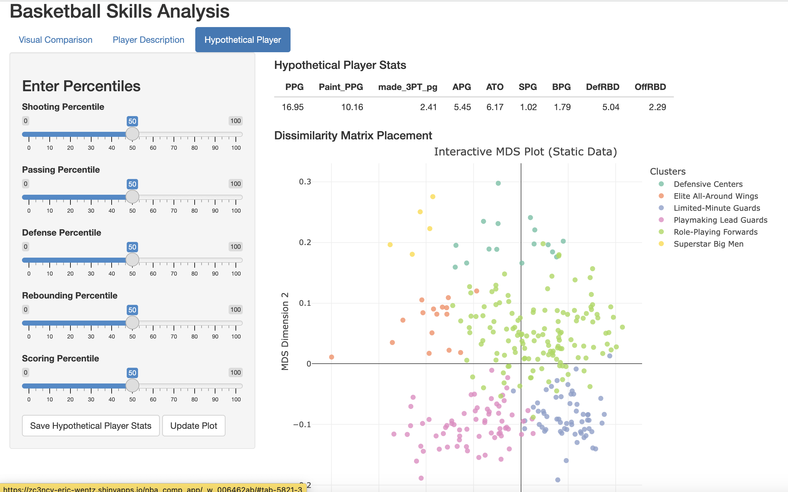
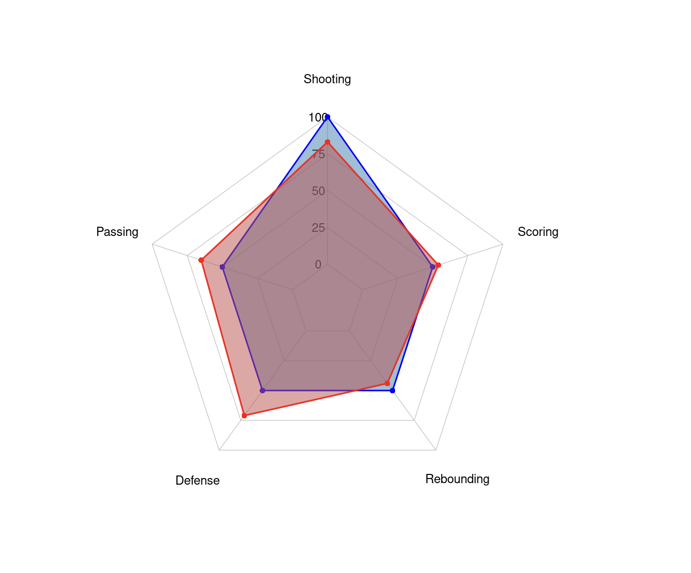

This project presents an **interactive NBA player comparison app**, allowing users to evaluate basketball skills, compare their attributes to NBA players, and create hypothetical player profiles using **percentile-based metrics**.

### **Project Highlights**
- **Data Sources**: Player statistics from the NBA database.
- **Key Features**:
  - Compare **your skills** to **real NBA players**.
  - Find **the top 3 most similar NBA players** to a given set of attributes.
  - Generate **custom radar charts** to visualize player profiles.
  - Explore **an interactive scatter plot** mapping player styles.
- **Tools Used**: `shiny`, `ggplot2`, `plotly`, `dplyr`, `DT`.

---

### **🔹 Features & Methodology**
#### **🏀 Player Skill Comparison**
- Users **input their own basketball attributes** (shooting, passing, defense, rebounding, scoring).
- The app **compares these attributes** to a dataset of NBA players.
- Displays **the top 3 closest players** based on Euclidean distance.

#### **📊 Radar Charts for Visual Representation**
- **Radar charts** visualize how a user or NBA player ranks across **5 key basketball skills**.
- The app **calculates the area of the radar chart** to measure similarity.
- Users can compare their radar chart **side-by-side** with real NBA players.

#### **📈 Interactive Scatter Plot (MDS)**
- Displays **NBA player clusters** based on similarity.
- Users can see where their **custom or hypothetical player** falls among real NBA players.

#### **🔮 Hypothetical Player Builder**
- Users **input percentile values** for each skill.
- The app **converts percentiles into real NBA statistics**.
- **Custom player profiles** are generated and saved for future comparisons.

---

### **📽 Interactive Demo**
Check out the **NBA Player Comparison App** in action:

👆 **Click the image to open the interactive app.**

---

### **Example Radar Chart**
Below is an example of a **radar chart comparing two NBA players**:

---

### **🚀 Try the App Now**
Ready to see which **NBA player you play like**?  
[Open the NBA Player Comparison App](https://zc3ncy-eric-wentz.shinyapps.io/nba_comp_app/)

---

