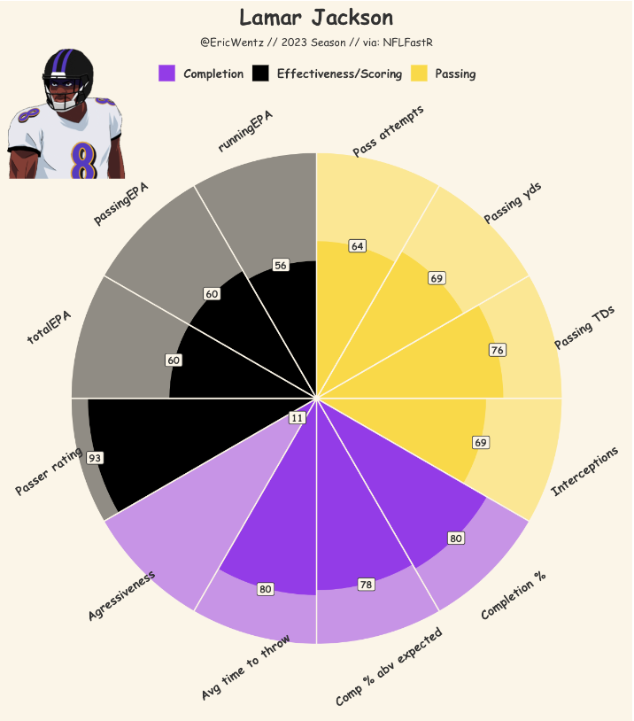

This project uses **Next Gen Stats, Pro Football Reference, and ESPN QBR data** to generate percentile-based visualizations of NFL quarterbacks. 

### **Project Highlights**
- **Data Sources**: Next Gen Stats, Pro Football Reference, ESPN QBR.
- **Key Insights**: QB playstyle, efficiency, and advanced metrics.
- **Tools Used**: `ggplot2`, `tidyverse`, `dplyr`, `grid`, `png`.

### **Methodology**
The project processes quarterback data by:
1. **Loading Next Gen Stats, Advanced Stats, and QBR Data**.
2. **Filtering & Cleaning Data** (e.g., removing duplicates, ensuring completeness).
3. **Computing Percentiles** for key metrics (e.g., **Passing TDs, Completion %, EPA**).
4. **Generating Polar Plots** for **visual representation**.

### **Example Visuals**
This project includes **custom QB visualizations** like the one below:

### **Notable Players Included**
- **C.J. Stroud**
- **Lamar Jackson**
- **Patrick Mahomes**
- Many more!

[Check out the full project on GitHub.](https://github.com/Ericwentz5/QB_polar)**

