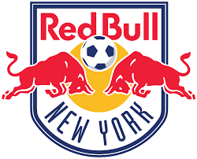

This project provides a **detailed match analysis of the New York Red Bulls**, using advanced soccer metrics and visualizations.

### **Project Highlights**
- **Data Sources**: MLS Stats, Wyscout, Opta.
- **Key Insights**: Passing networks, xG analysis, defensive structures, and key match trends.
- **Tools Used**: `ggplot2`, `tidyverse`, `dplyr`, `gganimate`, `ggridges`.

### **Methodology**
This analysis focuses on:
1. **Passing Trends & Efficiency** → Examining completed vs. incomplete passes by zone.
2. **Expected Goals (xG) Analysis** → Evaluating shot quality & efficiency.
3. **Defensive Performance** → Analyzing opponent shot selection & defensive structure.
4. **Possession Breakdown** → Comparing time of possession and playing style.

---

### **📊 Key Match Insights**
#### **🔹 Passing Breakdown**
- The **defending third had the highest number of incomplete passes** despite having the **fewest pass attempts**.
- **10% of passes in the defending third were incomplete**, compared to **6% in the attacking third** and **3.9% in the middle third**.
- **67% of turnovers were unforced**, highlighting a lack of ball security.

#### **🔹 xG & Shooting Analysis**
- The Red Bulls generated **1.797 expected goals (xG)**, outperforming the **MLS league average of 1.347**.
- **47% of shots came from outside the box**, in line with the MLS average, but the Red Bulls were **far more efficient from distance**.
- **19-yard goal in the second minute** → Showed confidence in long-range shooting.

#### **🔹 Defensive Effectiveness**
- Opposing offense managed just **7 total shots** and only **2 on target**.
- **Average shot distance conceded: 21.76 yards** → No clean looks in the penalty area.

#### **🔹 Possession & Playing Style**
- **Opposition controlled the ball for nearly 14 more minutes** despite losing **4-0**.
- Red Bulls' **"run and gun" style** led to quick turnovers but high shot volume.
- **Early goal in the second minute** likely influenced their high-risk, high-reward approach.

---

### **📽 Interactive Slideshow**
To explore **dynamic passing networks, shot maps, and possession trends**, check out the **interactive slideshow below**:

👆 **Click the image to view the full match analysis slideshow.**

---

### **Final Thoughts**
The New York Red Bulls’ approach revolves around:
✅ **Fast-paced attacking play** → Prioritizing shot volume over possession.  
✅ **Aggressive shooting from distance** → More effective than MLS averages.  
✅ **Defensive pressure forcing low-quality shots** → Limiting opponent efficiency.  

This **high-energy, counter-attacking style** secured a **4-0 victory** despite **having significantly less possession**.

---

